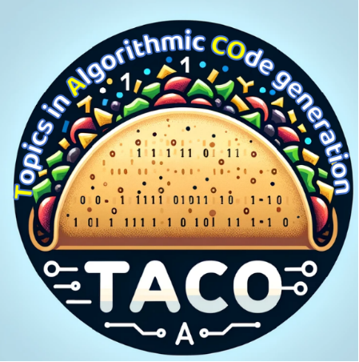
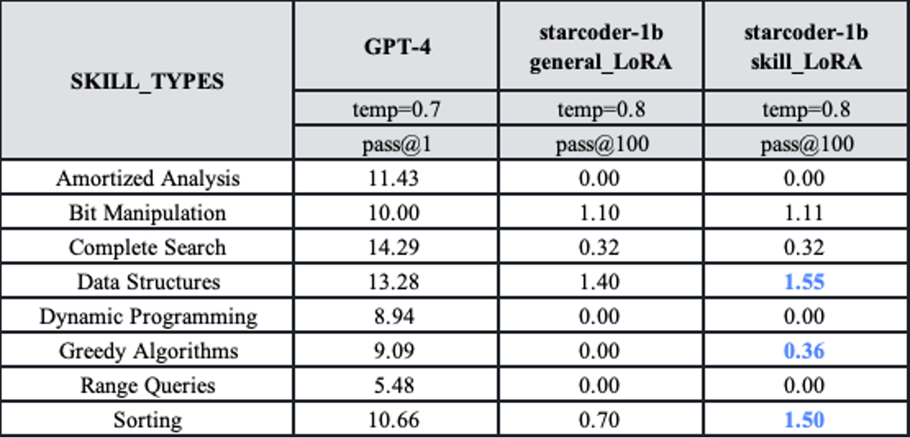

<p align="center">
  
</p>

# TACO(Topics in Algorithmic Code generation dataset)
<p align="center">
        🤗 <a href="https://huggingface.co/datasets/BAAI/TACO">Hugging Face</a>&nbsp&nbsp | &nbsp&nbsp <a href="https://data.baai.ac.cn/details/BAAI-TACO"> BAAI DataHub</a>&nbsp&nbsp | &nbsp&nbsp <a href="https://arxiv.org/abs/2312.14852">Paper</a>
</p>
<br>

TACO (Topics in Algorithmic COde generation dataset) is a dataset focused on algorithmic code generation, designed to provide a more challenging training dataset and evaluation benchmark for the code generation model field. The dataset consists of programming competition problems that are more difficult and closer to real programming scenarios. It emphasizes improving or evaluating the model's understanding and reasoning abilities in practical application scenarios, rather than just implementing predefined function functionalities.

- **Larger scale**: TACO includes a training set (25,443 problems) and a test set (1,000 problems), making it the largest code generation dataset currently available.
- **Higher quality:** Each problem in the TACO dataset is designed to match a diverse set of solution answers, with answer sizes of up to 1.55M. This ensures that the model is not prone to overfitting during training and validates the effectiveness of evaluation results.
- **Fine-grained labels:** Each problem in the TACO dataset includes fine-grained labels such as task topics, algorithms, skills, and difficulty levels. These labels provide more accurate references for the training and evaluation of code generation models.

## News and Updates
- 🚀🚀🚀[2024/06/19] **Announcing Testing Framework Update: Bug Fixes and Enhanced Functionality!** We're excited to announce the release of our first version after extensive manual validation and debugging efforts. In this update, we've addressed several bugs in our testing framework for the quoted APPS benchmark. We double-checked the test cases and updated TACO test set to a new version.

  Details on the fixes can be found [here](https://github.com/FlagOpen/TACO/commit/2ba62351f3d511b08e52e3204198d5fafa006230). 

- 🔥🔥🔥[2024/04/11] **Announcing the Release of Part of TACO (Topics in Algorithm for Code) Project Models on Hugging Face!** We've full fine-tuned top-tier code models like CodeLlama and Starcoder, ranging from 1B to 15B parameters, specifically tailored for competitive algorithmic challenges. Check out our models under [FlagOpen](https://huggingface.co/flagopen) on Hugging Face. Join us in advancing the Code & LLMs community! 🏋️‍♂️👩‍💻

## Download and Use
🤗 <a href="https://huggingface.co/datasets/BAAI/TACO">Hugging Face</a>

First, install the `datasets` package.
```
pip install -U datasets
```
Then, load the dataset with the following program. 
```Python
from datasets import load_dataset
taco = load_dataset('BAAI/TACO', token=YOUR_HF_TOKEN)
```
- You can also specify the split ("train" or "test") through
    ```Python
    from datasets import load_dataset
    taco = load_dataset('BAAI/TACO', split='train', token=YOUR_HF_TOKEN)
    ```
- You can also specify the difficulties (a list choosing from ["EASY", "MEDIUM", "MEDIUM_HARD", "HARD", "VERY_HARD"] or ["ALL"] as default) or skills (a list choosing from ["Data structures", "Sorting", "Range queries", "Complete search", "Amortized analysis", "Dynamic programming", "Bit manipulation", "Greedy algorithms"] or ["ALL"] as default) by passing the list of difficulties or skills as a list.
    ```Python
    from datasets import load_dataset
    taco_difficulties = load_dataset('BAAI/TACO', difficulties=['EASY'], token=YOUR_HF_TOKEN)
    ```
    ```Python
    from datasets import load_dataset
    taco_skills = load_dataset('BAAI/TACO', skills=['Sorting', 'Range queries'], token=YOUR_HF_TOKEN)
    ```

<a href="https://data.baai.ac.cn/details/BAAI-TACO">BAAI DataHub</a>
First, download the dataset and unzip it into a folder named "BAAI-TACO."
Then, load the dataset with the following program. 
```Python
from datasets import load_from_disk
taco = load_from_disk(PATH_TO_BAAI-TACO)
```
- You can also specify the split ("train" or "test") through
    ```Python
    from datasets import load_from_disk
    taco = load_from_disk(PATH_TO_BAAI-TACO)['train']
    ```
- You can also specify the difficulties (a list choosing from ["EASY", "MEDIUM", "MEDIUM_HARD", "HARD", "VERY_HARD"] or ["ALL"] as default) or skills (a list choosing from ["Data structures", "Sorting", "Range queries", "Complete search", "Amortized analysis", "Dynamic programming", "Bit manipulation", "Greedy algorithms"] or ["ALL"] as default) by passing the list of difficulties or skills as a list.
    ```Python
    from datasets import load_from_disk
    difficulties=['EASY']
    taco = load_from_disk(PATH_TO_BAAI-TACO)
    taco_difficulties = taco.filter(lambda entry: entry['difficulty'] in difficulties)
    ```
    ```Python
    from datasets import load_from_disk
    skills=set(['Sorting', 'Range queries'])
    taco = load_from_disk(PATH_TO_BAAI-TACO)
    taco_skills = taco.filter(lambda entry: set(eval(entry['skill_types'])) & skills)
    ```

## Statistics of TACO

| Comparison Dimension        | TACO         | CodeContest   | APPS         | HumanEval(/-X) | MBP(/X)P      |
|-----------------------------|--------------|---------------|--------------|-----------------|---------------|
| Problem Scale (train/dev/test) | 25443/-/1000 | 13328/117/165 | 5000/-/5000  | -/-/164         | 374/-/500     |
| No Answers in Test Set      | 0            | 43/165        | 1235/5000    | 0               | 0             |
| Duplicate Questions         | No Duplication| No Duplication| No Duplication| Duplicates Removed| Duplicates Removed|
| Duplicate Answers           | Duplicates Removed| No Duplication| No Duplication| Duplicates Removed| Duplicates Removed|
| Test Cases/Problems     | 202.3        | 203.7         | 20.99        | 7.77            | 3             |
| Task Topics                 | Yes          | Yes           | No           | No              | No            |
| Algorithm Tags              | Yes          | No            | No           | No              | No            |
| Programming Skills          | Yes          | No            | No           | No              | No            |
| Difficulty Tags             | Yes          | Yes           | Yes          | No              | No            |

The Distribution of Algorithm Tags in TACO is 

<center>

</center>

The Distribution of Programming Skills in TACO is

<center>

</center>

## Evaluation with TACO
First, you should initialize model, tokenizer as well as the difficulties or skills to use TACO.

```Python
# Initialize model and tokenizer
model_name = 'codellama/CodeLlama-7b-hf'
tokenizer = AutoTokenizer.from_pretrained(model_name)
model = AutoModelForCausalLM.from_pretrained(model_name)
device = "cuda:0"
model = model.to(device)


# Initialize evaluation dataset 
difficulties = ['ALL']
# difficulties = ["EASY", "MEDIUM", "MEDIUM_HARD", "HARD", "VERY_HARD"] 
# skills = ['ALL']
# skills = ["Data structures", "Sorting", "Range queries", "Complete search", "Amortized analysis", "Dynamic programming", "Bit manipulation", "Greedy algorithms"]

from datasets import load_dataset
taco = load_dataset('BAAI/TACO', split='test', difficulties=difficulties)
# taco = load_dataset('BAAI/TACO', split='test', skills=skills)
```
Then, run generations with code models.
```Python
# setting up times of run
n_samples = 200
temperature = 0.2
top_p = 0.95 
output = []
for idx, sample in enumerate(taco):
    prompt = sample['question']
    results = {"task_id": idx, "prompt": prompt}
    generations = []
    for i in range(n_samples):
        seed = i
        generation = predict(device, model, tokenizer, prompt, seed, top_p, temperature, max_length=2048)
        clean_code = truncate_after_eof_strings(generation)
        generations.append(clean_code)
    results["output"] = generations
    output.append(results)
```
`generation.py` gives a complete example of generate TACO result samples with CodeLlama, which outputs a JSON format file `generation.json`.
```JSON
[
    {
        "task_id": 0,
        "prompt": "The city park of IT City contains n east to ...",
        "output": [
            "\ndef solve(n):\n    return n**5 - 10*n**4 + 40*n**3 ...",
            "\ndef solve(n):\n    return n**5 - 10*n**4 + 40*n**3 ...",
            ...
        ]
    },
    {
        "task_id": "1",
        "prompt": "Zookeeper is buying a carton of fruit to feed ...",
        "output": [
            "\ndef solve(n, s):\n    pre, suf, ans = [0]*n, [0]*n, ...",
            "\ndef solve(n, s):\n    pre, suf, ans = [0]*n, [0]*n, ...",
            ...
        ]
    },
    ...
]
```

Finally, execute the generated codes and compute metrics.
`compute_metric.py` gives a complete example of code execution and pass@k computation with `generation.json` from last step.

The result file `taco_metrics.json` is like
```JSON
{
    "pass@1": 0.0932,
    "pass@10": 0.1515,
    "pass@100": 0.1999,
    "detail" : {
        "pass@1": {
            "0": ...,
            "1": ...,
            ...
        },
        "pass@10": {
            "0": ...,
            "1": ...,
            ...
        },
        "pass@100": {
            "0": ...,
            "1": ...,
            ...
        },
    }
}
```

## Finetuning with TACO
First, you should tokenize the training set of TACO. We provide a python script `pretokenizing.py` and an example shell script `pretokenize.sh` to help you. This step would output a pretokenized training data in `cache_dir` with the name of `dataset_name`. Below is an example to tokenize with CodeLlama-7b. 

```shell
python pretokenizing.py \
    --tokenizer_dir codellama/CodeLlama-7b-hf \
    --cache_dir . \
    --dataset_name codellama_tokenized 
```

Then, finetune with the pretokenized training data. We provide a python script `train.py` and an example shell script `finetune.sh` to help you. This step would output the checkpoints in `output_dir`. Below is an example to finetuning CodeLlama-7b. 

```shell
torchrun --nproc_per_node=8 --nnodes=1 train.py \
    --model_name_or_path codellama/CodeLlama-7b-hf \
    --data_path codellama_tokenized \
    --bf16 True \
    --output_dir codellama_ft \
    --num_train_epochs 2 \
    --per_device_train_batch_size 4 \
    --gradient_accumulation_steps 8 \
    --evaluation_strategy "no" \
    --save_strategy "steps" \
    --save_steps 500 \
    --save_total_limit 1 \
    --learning_rate 5e-5 \
    --weight_decay 0.1 \
    --warmup_ratio 0.1 \
    --logging_steps 1 \
    --resume_from_checkpoint True \
    --gradient_checkpointing True \
    --deepspeed ds_configs/deepspeed_z2_config_bf16.json
```

## Evaluation Results
We conducted experiments using the TACO test set and training set on GPT-4 and a code generation model trained on a large amount of code data. The results show:

- The TACO test set is highly challenging, with GPT-4 achieving a pass@1 score of only 31.5 at the easy level. Except for GPT-4, the pass@1 scores of various code models across five difficulty levels are generally below 10. Even the pass@100 scores are not as high as GPT-4's pass@1
    <center>
    
    </center>

- Utilizing the TACO training set with fine-grained labels can selectively enhance the performance of code generation models. For instance, after fine-tuning starcoder-1b on specific skills using the TACO training set, there is a noticeable improvement in performance.

    <center>
    
    </center>

## Citation
If you use the models, data, or code from this project, please cite the original paper:

```
@article{li2023taco,
  title={TACO: Topics in Algorithmic COde generation dataset},
  author={Rongao Li and Jie Fu and Bo-Wen Zhang and Tao Huang and Zhihong Sun and Chen Lyu and Guang Liu and Zhi Jin and Ge Li},
  journal={arXiv preprint arXiv:2312.14852},
  year={2023}
}
```

## License
The TACO dataset that is authored by BAAI, Shandong Normal University and Peking University is released under an [Apache 2.0 License](https://www.apache.org/licenses/LICENSE-2.0). However, the data also includes content licensed under other permissive licenses such as MIT License, or web-crawled data which is used under the terms of the CC BY 4.0 license([Creative Commons Attribution 4.0 International license](https://creativecommons.org/licenses/by/4.0/legalcode)).

We gratefully acknowledge the contributions of the following:
*   some AtCoder, Codeforces, CodeWars, Kattis, LeetCode material curated from APPS dataset (https://github.com/hendrycks/apps)
*   some Aizu, AtCoder, CodeChef, Codeforces material curated from CodeContest dataset (https://github.com/google-deepmind/code_contests)
*   Codeforces materials are sourced from http://codeforces.com.
*   CodeChef materials are sourced from https://www.codechef.com.
*   GeekforGeeks materials are sourced from https://www.geeksforgeeks.org
*   HackerEarth materials are curated from:
    [Description2Code Dataset](https://github.com/ethancaballero/description2code),
    licensed under the
    [MIT open source license](https://opensource.org/licenses/MIT), copyright
    not specified.
*   HackerRank materials are sourced from https://www.hackerrank.com. We don't know what the legal rights or data licenses of HackerRank. Please contact us if there is data license.
